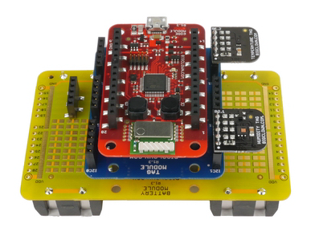
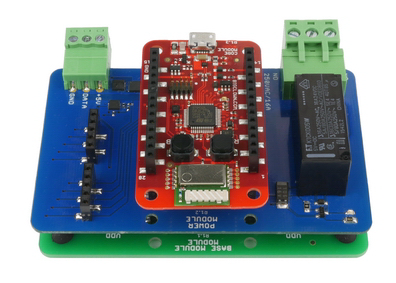

# BigClown bcp-wireless-circus

Firmware for projects

* [Smart LED Strip](https://doc.bigclown.cz/smart-led-strip.html)
* [Jednoduché programování domácí automatizace](https://doc.bigclown.cz/easy-programming.html)
* [Workroom project](https://www.bigclown.com/project/lets-build-your-own-home-automation/)

## Tags
* [Humidity Tag](https://shop.bigclown.com/products/humidity-tag)
* [Lux Meter Tag](https://shop.bigclown.com/products/lux-meter-tag)
* [Barometer Tag](https://shop.bigclown.com/products/barometr-tag)
* [Temperature Tag](https://shop.bigclown.com/products/temperature-tag)

## Remote
* 1x [BigClown Core Module](https://shop.bigclown.com/products/core-module)
* 1x [Tag Module](https://shop.bigclown.com/products/tag-module)
* 1x [BigClown Battery Module](https://shop.bigclown.com/products/battery-module)
* Tags



## Base
* 1x [BigClown Core Module](https://shop.bigclown.com/products/core-module)
* 1x [BigClown Power Module](https://shop.bigclown.com/products/power-module)
* 1x [BigClown Base Module](https://shop.bigclown.com/products/base-module)
* Tags



## Hub (Gateway)
* 1x [BigClown Raspberry Pi](https://shop.bigclown.com/products/raspberry-pi-3-set)


### MQTT

#### LED

  * On
    ```
    mosquitto_pub -t "node/base/led/-/state/set" -m true
    ```
  * Off
    ```
    mosquitto_pub -t "node/base/led/-/state/set" -m false
    ```
  * Get state
    ```
    mosquitto_pub -t "node/base/led/-/state/get" -n
    ```

##### LED strip

  * On
    ```
    mosquitto_pub -t "node/base/light/-/state/set" -m true
    ```
  * Off
    ```
    mosquitto_pub -t "node/base/light/-/state/set" -m false
    ```
  * Get state
    ```
    mosquitto_pub -t "node/base/light/-/state/get" -n
    ```
  * For 144 x RGBW LED strip, set all the lights on the red, data are encoded in base64
    ```
    mosquitto_pub -t "node/base/led-strip/-/framebuffer/set" -m '"/wAAAP8AAAD/AAAA/wAAAP8AAAD/AAAA/wAAAP8AAAD/AAAA/wAAAP8AAAD/AAAA/wAAAP8AAAD/AAAA/wAAAP8AAAD/AAAA/wAAAP8AAAD/AAAA/wAAAP8AAAD/AAAA/wAAAP8AAAD/AAAA/wAAAP8AAAD/AAAA/wAAAP8AAAD/AAAA/wAAAP8AAAD/AAAA/wAAAP8AAAD/AAAA/wAAAP8AAAD/AAAA/wAAAP8AAAD/AAAA/wAAAP8AAAD/AAAA/wAAAP8AAAD/AAAA/wAAAP8AAAD/AAAA/wAAAP8AAAD/AAAA/wAAAP8AAAD/AAAA/wAAAP8AAAD/AAAA/wAAAP8AAAD/AAAA/wAAAP8AAAD/AAAA/wAAAP8AAAD/AAAA/wAAAP8AAAD/AAAA/wAAAP8AAAD/AAAA/wAAAP8AAAD/AAAA/wAAAP8AAAD/AAAA/wAAAP8AAAD/AAAA/wAAAP8AAAD/AAAA/wAAAP8AAAD/AAAA/wAAAP8AAAD/AAAA/wAAAP8AAAD/AAAA/wAAAP8AAAD/AAAA/wAAAP8AAAD/AAAA/wAAAP8AAAD/AAAA/wAAAP8AAAD/AAAA/wAAAP8AAAD/AAAA/wAAAP8AAAD/AAAA/wAAAP8AAAD/AAAA/wAAAP8AAAD/AAAA/wAAAP8AAAD/AAAA/wAAAP8AAAD/AAAA/wAAAP8AAAD/AAAA/wAAAP8AAAD/AAAA/wAAAP8AAAD/AAAA/wAAAP8AAAD/AAAA/wAAAP8AAAD/AAAA"'
    ```
  * Config
    * [LED Strip RGBW 1m 144 LEDs](https://shop.bigclown.com/products/led-stripe-rgbw-1m-144leds-glue)
      ```
      mosquitto_pub -t "node/base/led-strip/-/config/set"  -m '{"type": "rgbw", "count": 144}'
      ```
    * [LED Strip RGB 5m 150 LEDs](https://shop.bigclown.com/products/led-stripe-5m)
      ```
      mosquitto_pub -t "node/base/led-strip/-/config/set"  -m '{"type": "rgb", "count": 150}'
      ```

#### Relátko na power modulu
  * On
    ```
    mosquitto_pub -t 'node/base/relay/-/state/set' -m true
    ```
    > **Hint** First aid:
    If the relay not clicked, so make sure you join 5V DC adapter to Power Module

  * Off
    ```
    mosquitto_pub -t 'node/base/relay/-/state/set' -m false
    ```
  * Get state
    ```
    mosquitto_pub -t 'node/base/relay/-/state/get' -n
    ```

#### Relay module

  * On
    ```
    mosquitto_pub -t "node/base/relay/0:0/state/set" -m true
    mosquitto_pub -t "node/base/relay/0:1/state/set" -m true
    ```
  * Off
    ```
    mosquitto_pub -t "node/base/relay/0:0/state/set" -m false
    mosquitto_pub -t "node/base/relay/0:1/state/set" -m false
    ```
  * Get state TODO:
    ```
    mosquitto_pub -t "node/base/relay/0:0/state/get" -n
    mosquitto_pub -t "node/base/relay/0:1/state/get" -n
    ```

#### LCD module
  * Write text, supported font size [14, 28], default font is 14
    ```
    mosquitto_pub -t "node/base/lcd/-/text/set" -m '{"x": 5, "y": 10, "text": "BigClown"}'
    mosquitto_pub -t "node/base/lcd/-/text/set" -m '{"x": 5, "y": 40, "text": "BigClown", "font": 28}'
    ```
